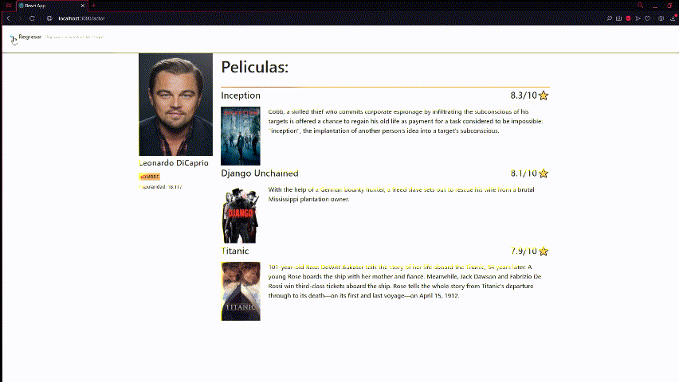

# Reto-React

  

## Pasos para iniciar proyecto
### 1- Ingresar a la carpeta Challenge, dentro de Reto-React
### 2- Ingresar el comando npm install parado en la carpeta challenge
### 3- ingresar el comando npm start parado en la carpeta challenge
### 4- Disfrutar del proyecto

#### Proyecto desarrollado con React, Redux y Ant desing